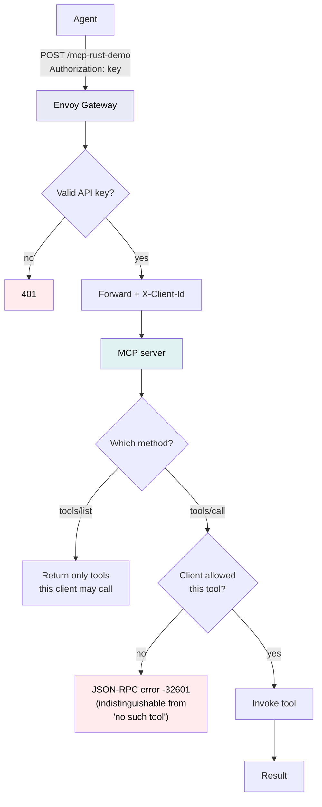
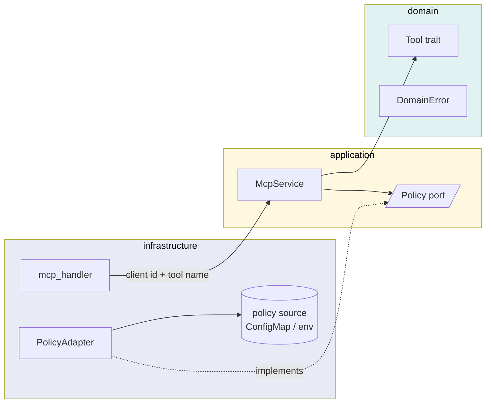
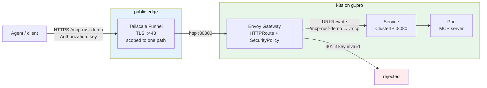
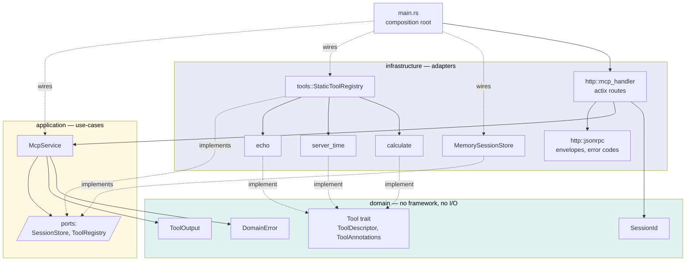
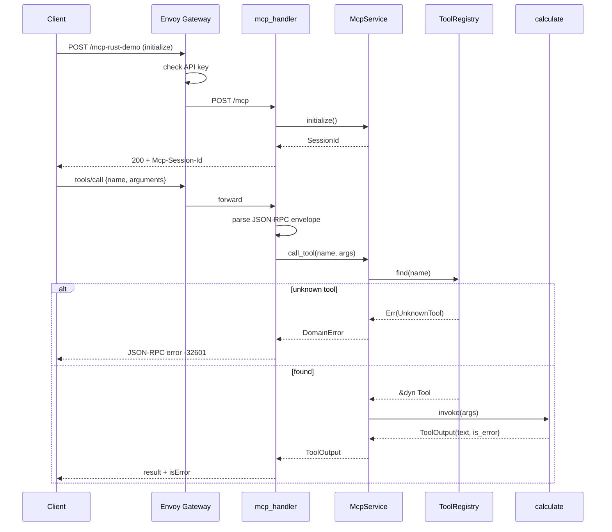

# mcp-rust-demo-001

A demo **MCP (Model Context Protocol) server** in Rust, served over HTTP so a remote agent
can call it as a tool provider. Built with actix-web, arranged in clean-architecture layers,
and shipped as a 2.4 MB container image.

Transport is **Streamable HTTP** (MCP spec `2025-03-26`): JSON-RPC 2.0 over a single
endpoint.

## Quick start

```bash
cargo run
```

Then, in another shell:

```bash
curl -s localhost:8080/healthz

curl -s localhost:8080/mcp \
  -H 'Content-Type: application/json' \
  -H 'Accept: application/json, text/event-stream' \
  -d '{"jsonrpc":"2.0","id":1,"method":"tools/list"}'
```

Connect a local MCP client by pointing it at `http://localhost:8080/mcp` with transport
type `http`.

To exercise every method against a running server — local or deployed — use:

```bash
scripts/smoke-remote.sh http://localhost:8080/mcp
```

It prints the full request — method, URL, headers, pretty-printed body — next to each
response and HTTP status, so any step can be lifted out and re-run by hand. Covers
`initialize`, `tools/list`, all three tools, `ping`, a deliberate tool failure, an unknown
method, and `DELETE`.

```
scripts/smoke-remote.sh --quiet   # responses only
scripts/smoke-remote.sh --raw     # no pretty-printing
scripts/smoke-remote.sh --help
```

## Endpoints

| Method | Path | Purpose |
|---|---|---|
| `POST` | `/mcp` | JSON-RPC requests and notifications |
| `GET` | `/mcp` | SSE stream for server-initiated messages |
| `DELETE` | `/mcp` | End the session |
| `GET` | `/healthz` | Liveness probe (not part of MCP) |

Supported methods: `initialize`, `notifications/initialized`, `tools/list`, `tools/call`,
`ping`.

`initialize` returns an `Mcp-Session-Id` header; echo it on later requests. A session id the
server did not issue is rejected, which normally means the server restarted — call
`initialize` again.

## Tools

| Tool | Input | Returns |
|---|---|---|
| `echo` | `message: string` | The same message — connectivity check |
| `get_server_time` | `timezone?: string` (IANA) | Current time, RFC 3339 |
| `calculate` | `expression: string` | Result of `+ - * / %`, parentheses, unary minus |

A tool that fails *semantically* (bad timezone, division by zero) returns a normal result
with `isError: true`, so the calling model can read the reason and react. JSON-RPC error
codes are reserved for protocol faults.

## Configuration

Environment variables only, so the same image runs locally and in a cluster.

| Variable | Default | Purpose |
|---|---|---|
| `BIND_ADDR` | `0.0.0.0:8080` | Listen address |
| `MCP_SERVER_NAME` | `mcp-rust-demo-001` | Name reported in `initialize` |
| `RUST_LOG` | `info` | `tracing` filter, e.g. `debug`, `warn` |

Logs are human-readable in debug builds and JSON in release builds.

## Container

```bash
scripts/build-image.sh          # build for linux/amd64, then smoke test it
scripts/build-image.sh --help
```

The script builds the image, starts it, and verifies `/healthz`, an `initialize` handshake,
`tools/list`, and a real `tools/call` before reporting success. It exits non-zero if any
step fails.

The image is an Alpine/musl build with a `scratch` runtime — the binary is statically
linked, so the image carries nothing else (**2.4 MB**). Note that this means **no shell**:
`docker exec`/`kubectl exec` will not work, so debug from logs or use `kubectl debug` with
an ephemeral container. Switch the final stage to `alpine:3.21` (~5.6 MB) if you want a
shell available.

## Authentication

The gateway requires an API key on the `Authorization` header; the server itself is
unauthenticated, so the key is enforced entirely at the edge.

```bash
scripts/apply-auth.sh --generate   # mint a key into .env and apply it
scripts/apply-auth.sh --show       # print it (to paste into a client)
scripts/apply-auth.sh --remove     # drop the policy, leaving the route open
```

The key lives only in `.env`, which is gitignored — copy `.env.example` to start. Scripts
read `MCP_API_KEY` from there (or the environment); nothing hardcodes it.

```bash
curl -s -X POST "$URL" -H 'Content-Type: application/json' \
  -H "Authorization: $(scripts/apply-auth.sh --show)" \
  -d '{"jsonrpc":"2.0","id":1,"method":"initialize","params":{}}'
```

Rotate the key at any time — regenerate, apply, and update the client:

```bash
scripts/apply-auth.sh --generate && scripts/apply-auth.sh --show
```

### Moving to workload identity

A static key has no expiry, no revocation and no per-caller identity beyond whoever holds
it. `k8s/securitypolicy-jwt.yaml` is an unapplied template that replaces it with JWT
validation against an identity provider: the gateway verifies the token and passes the
caller's identity down as plain headers, so the server keeps reading a header and does not
parse tokens itself.

Two things to get right:

- For machine-to-machine callers use an **app role**, not a delegated scope. A
  client-credentials token carries a `roles` claim and never `scp`, so a scope-only setup
  rejects every call.
- Check the `iss` on a real token before trusting the configured issuer — v1 and v2
  endpoints differ, and a mismatch fails as a bare 401 with nothing to explain it.

**The switch is all-or-nothing.** A `SecurityPolicy` accepts `apiKeyAuth` and `jwt` as
sibling fields and reports `Accepted=True` with both set, but at runtime the combination
rejects everything — including credentials that worked a moment earlier. Verified on
2026-09-12: key-only works, JWT-only works, both together returns 401 for each. Plan a hard
cutover, and confirm every caller can present a token first.

Test the token side before switching anything:

```bash
scripts/get-token.sh --check    # does the token carry the app role?
scripts/get-token.sh --claims   # full decoded claims
MCP_AUTH_MODE=jwt scripts/smoke-remote.sh
```

`--check` reports `iss`, `aud`, `appid` and `roles`, which is the fastest way to catch the
two failures above — a missing `roles` claim, or an issuer that does not match the policy.

## Deploying to Kubernetes

Manifests are in `k8s/`. The image is imported directly into the node's containerd rather
than pulled from a registry, so `imagePullPolicy` is `IfNotPresent` and the tag must already
exist on the node.

```bash
scripts/deploy.sh --dry-run   # validate manifests, change nothing
scripts/deploy.sh             # build, import, apply, verify
scripts/apply-auth.sh         # API-key Secret + SecurityPolicy
```

A first-time deploy needs both. `deploy.sh` handles the image and the routing manifests
(namespace, deployment, service, httproute, referencegrant); `apply-auth.sh` handles the
SecurityPolicy, which is separate because its Secret is built from the key in `.env` rather
than applied from a file. `deploy.sh` reports whether the auth policy is present, so a
deployment left unauthenticated is visible rather than silent. Both are idempotent.

The script builds and smoke tests the image, copies it to the node over ssh, imports it into
containerd (this needs sudo on the node, so it prompts), applies the manifests, forces a
rollout, and verifies the ingress route resolves and answers an MCP handshake.

The image is imported in two ssh steps rather than one piped command: ssh will not allocate a
TTY when stdin is a pipe, and sudo needs a TTY to prompt. The script stages the tarball, then
imports it.

**Building for a different architecture than your machine?** The build verifies the compiled
binary's real ELF architecture, not just the image label — a builder stage pinned to
`$BUILDPLATFORM` produces a host-arch binary inside an image *labelled* for the target, which
only fails once it reaches the real hardware (`exec format error`).

## Using it from an agent

Point any MCP client at your deployment's endpoint with transport type `http`. The scripts
read it from `MCP_URL` in `.env`; this repo deliberately does not record a live endpoint. For Microsoft Foundry,
create a connection with `Key-based` authentication, header `Authorization`, and the value
from `scripts/apply-auth.sh --show`.

Once connected, these prompts exercise each tool. The agent decides to call a tool from its
description, so phrasing that implies live server state works best.

**Enumerate what is available**

```
What tools do you have available?
```

**Call each tool**

```
Use the echo tool to send back exactly: hello from Foundry
```

```
What time is it right now on the MCP server, in Asia/Bangkok?
```

The model cannot know this — any answer has to come from the server, which makes it a good
proof that the tool really ran.

```
Use the calculate tool to work out (2+3)*4.5, then 100/7, and tell me both results.
```

**Chain all three in one turn**

```
Do these three things using the MCP tools, and show each result:
1. echo the message "MCP demo"
2. get the server time in Asia/Bangkok
3. calculate (2+3)*4.5
```

**Show error handling**

A tool that fails semantically returns `isError: true` with the reason, rather than a
protocol error, so the model can read it and respond:

```
Use the calculate tool to compute 1/0. What does the server say?
```

```
Get the server time in the timezone "Mars/Olympus".
```

Expect `cannot evaluate '1/0': division by zero` and `unknown time zone 'Mars/Olympus';
expected an IANA name such as 'UTC'`.

**Agent instructions**

A default system prompt tends to make the agent *describe* the tools instead of calling
them. Something like this works better:

```
You are an assistant with access to MCP tools on a remote server.

When a user asks for the current time, always call get_server_time — never answer
from your own knowledge, as only the server knows its real clock. For arithmetic,
use the calculate tool rather than computing it yourself.

After each tool call, state which tool you used and show the raw result. If a tool
returns an error, report the server's message verbatim.
```

## Per-tool access control (design sketch)

**Not implemented.** This records where per-tool authorisation would go, and — as
importantly — what the protocol does and does not make possible.

### What each layer can decide



The gateway sees only `POST /mcp-rust-demo`. Every `tools/call` is that same URL with a
different JSON body, so **the gateway cannot make per-tool decisions** — it answers "may
this caller in?", never "may this caller run `delete_dag`?". Per-tool authorisation has to
live in the server, the only component that knows which tool was named.

Envoy's `apiKeyAuth` has a `forwardClientIDHeader` field, so the client id matched against
the Secret can be passed downstream. That is what gives the server a caller identity to
authorise against, without it having to verify credentials itself.

### Where it fits in the layers



`Policy` becomes a third outbound port beside `SessionStore` and `ToolRegistry`. The rule
source stays swappable — a static table today, a ConfigMap or an external service later —
without `application` or `domain` changing. Enforcement sits in `McpService::call_tool`, the
single chokepoint every tool invocation already passes through, and `list_tools` filters by
the same policy so a caller is never shown a tool it cannot use.

### Deny vs. require-approval

These are different things, and only one is a server concern:

| | Deny | Require approval |
|---|---|---|
| Effect | Tool never runs | Tool pauses for a human decision |
| Decided by | **The server** | **The client** |
| Mechanism | Filter from `tools/list`; error on `tools/call` | Client's own approval UI |

**MCP has no protocol-level approval flow.** A server cannot tell a client "run this only
after a human agrees". Approval is configured in the client — Claude Code and Claude Desktop
prompt per call, and Foundry has a require-approval setting on MCP tools. Do not try to build
it server-side; there is nowhere to put it in the protocol.

What a server *can* do is declare risk, via MCP tool annotations:

| Annotation | Means |
|---|---|
| `readOnlyHint` | Does not modify anything |
| `destructiveHint` | May delete or overwrite |
| `idempotentHint` | Safe to repeat |

These are **hints, not enforcement** — a client is free to ignore them. `ToolDescriptor` has
no annotations field today; adding one would be the smallest useful step, since it lets any
client gate on risk without this server changing again.

### Honest caveat

Per-tool RBAC only means something when the key identifies a *real* caller. There is one key
and one client here, so a policy table would have exactly one subject — the pattern without
the benefit. This becomes worth building when there are several callers at different trust
levels, or a tool that can destroy something. The three demo tools are pure functions over
their arguments and touch nothing.

## Architecture

### Request path, edge to tool



Authentication stops at the gateway: the server itself never sees a credential. The rewrite
means the app always serves `/mcp` and never learns its public path.

### Modules, and which way dependencies point



Arrows only ever point inward — `infrastructure` → `application` → `domain`. Nothing in
`domain` or `application` imports `actix_web`; an import like that is the signal that logic
has leaked outward.

### A tool call, end to end



Note the two failure modes are deliberately different. An unknown *method or tool* is a
protocol fault and returns a JSON-RPC error; a tool that runs and fails — `1/0`, a bad
timezone — returns a normal result with `isError: true`, so the model can read the reason
and react instead of seeing a transport failure.

### Layout

```
src/
  main.rs              composition root — the only place that wires the layers
  domain/              Tool trait, ToolAnnotations, ToolOutput, SessionId, DomainError
  application/         use-cases (McpService) + outbound ports (SessionStore, ToolRegistry)
  infrastructure/      actix handlers, JSON-RPC framing, tool impls, in-memory store
k8s/                   namespace, deployment, service, httproute, referencegrant, securitypolicy
scripts/               build-image.sh, deploy.sh, smoke-remote.sh, apply-auth.sh
```

Consequences worth knowing before you extend it:

- `domain` and `application` must never import `actix_web`. Such an import means logic has
  leaked outward.
- Adding a tool: implement `domain::Tool` under `infrastructure/tools/`, then register it in
  `StaticToolRegistry`. The registry drives both `tools/list` and `tools/call`, so they
  cannot drift apart.
- Replacing the in-memory session store (with Redis, say) means one new adapter plus one
  line in `main.rs` — no change to `application` or `domain`.

## Development

```bash
cargo test                              # unit tests
cargo clippy --all-targets -- -D warnings
cargo fmt
```

Sessions are held in memory, so a restart invalidates them. The server is otherwise
stateless.

## Status

The server is implemented, deployed to a k3s cluster behind an Envoy Gateway with API-key
authentication, published over HTTPS via Tailscale Funnel, and verified end to end from a
Microsoft Foundry agent.

TLS is terminated by Tailscale (Let's Encrypt); the Gateway listener behind it is plain HTTP.
The public tunnel is scoped to this service's path alone, so nothing else on the shared
gateway is reachable from the internet.

The API key is the only access control — there is no rate limiting, key expiry, or per-caller
audit, so treat this as a demo rather than a pattern to copy for anything touching real data.
